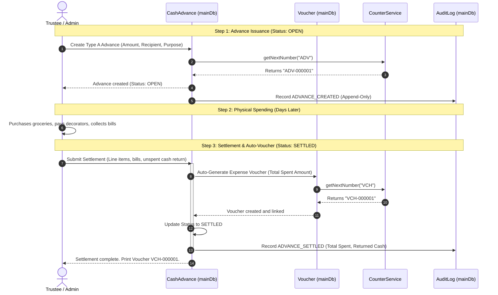
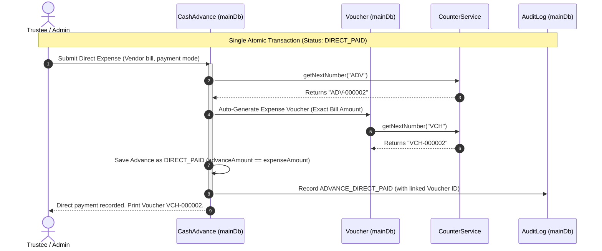

# WORKFLOW.md — Shri Gurudev Ashram ERP Core Financial Workflows

This document illustrates the core accounting and administrative workflows designed for the Shri Gurudev Ashram ERP extension, highlighting how the Phase 1 infrastructure supports upcoming operational modules.

---

## 1. Cash Advance & Settlement Workflow (Type A vs Type B)

The primary financial workflow in the Ashram revolves around issuing operational funds and reconciling expenditures. To maintain strict accounting correctness and prevent manual bookkeeping errors, all expenses MUST be tied to an underlying `CashAdvance` document, and expense vouchers are generated automatically upon settlement.

### 1.1 Type A: Standard Cash Advance (Multi-Day Event / Bulk Seva)
Used when a Trustee or staff member takes cash in advance for an upcoming ashram event (e.g., Mahashivratri festival, kitchen grocery stock).



---

### 1.2 Type B: Direct Vendor Payment (Immediate Expense)
Used for immediate spot expenses where no prior cash advance was issued (e.g., emergency plumbing repair, direct electricity bill payment).



---

## 2. Document Sequence Number Generation Workflow

All financial reference numbers (`ADV-`, `VCH-`, `CA-`, `CH-`, `UPI-`, `OL-`) are governed by the `Counter` service established in Phase 1 (`backend/src/services/counter.service.js`).

```mermaid
flowchart TD
    A[Service Requests New Number] --> B{Valid Prefix?}
    B -- No --> C[Throw Error: Invalid Prefix]
    B -- Yes --> D[MongoDB findOneAndUpdate with $inc: 1]
    D --> E{Counter Document Exists?}
    E -- No (Upsert: true) --> F[Create { _id: prefix, seq: 1 }]
    E -- Yes --> G[Atomically Increment seq by 1]
    F --> H[Format Number: PREFIX-PADDED_SEQ]
    G --> H
    H --> I[Return Formatted String e.g. ADV-000001]
```

---

## 3. Persistent Audit Logging Workflow

Every financial state transition or security event triggers an immutable append-only record in the `AuditLog` collection established in Phase 1.


